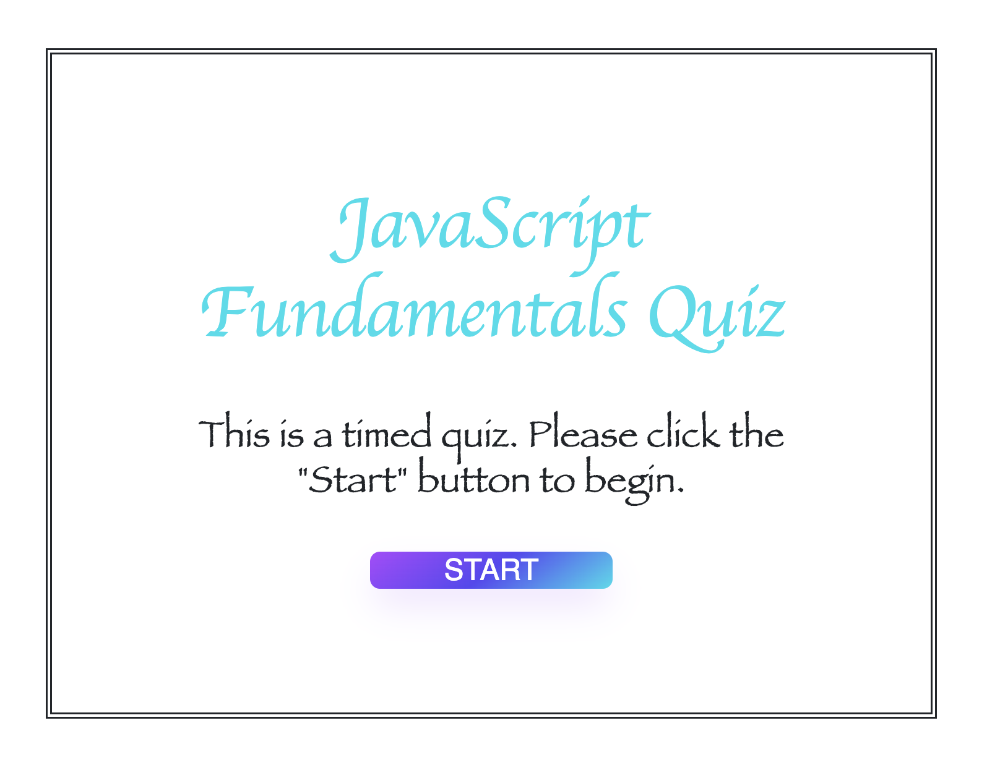
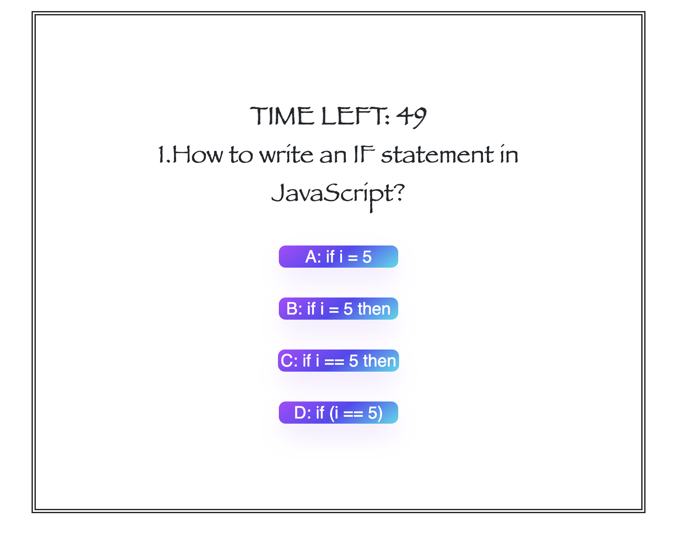
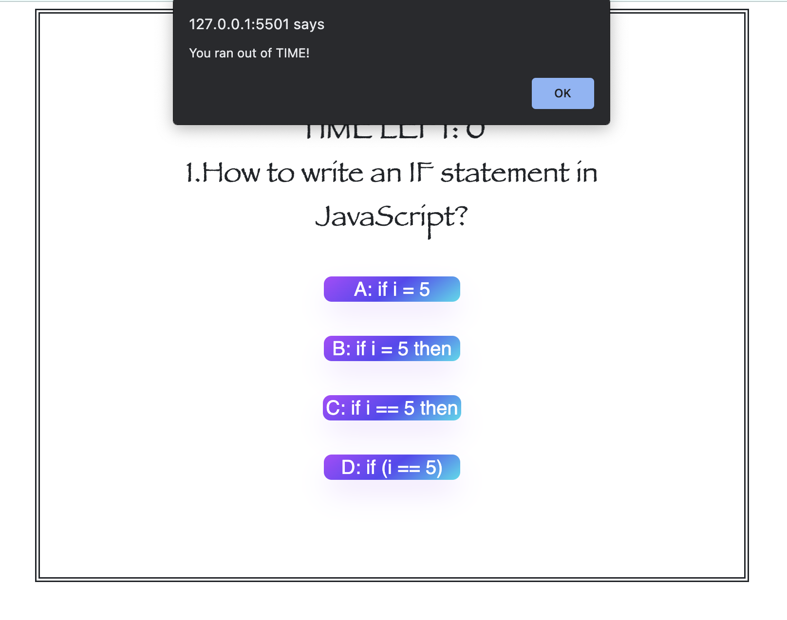
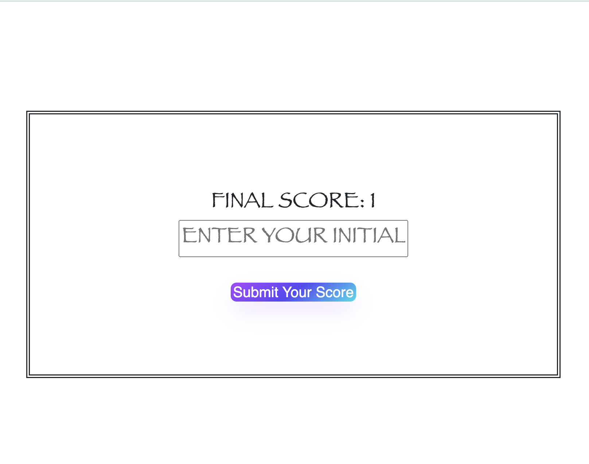
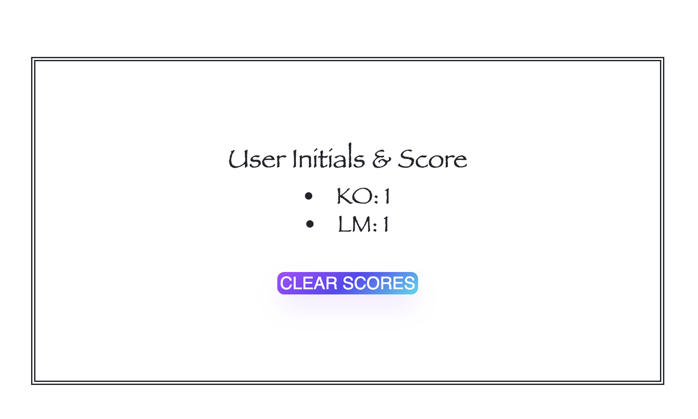

# code Quiz
This is a Javascript Fundamentals timed quiz. 

## Features

1. You can **START** the quiz, by clicking the start button on the **MAIN page**. 

    

2. Once you click the **START** button, you can see the question and answer options, and also how many seconds left. 

    

3. When you select an answer, it will let you know whether your choice is correct or incorrect. If you select a wrong one answer choice, you will lose **10 seconds** from your timer!

4. If the **TIME LEFT** is going to be **0**, it will let you know you ran out of the time then if you press. It will then direct you to the **Score** page.

    

5. Once you successfully finish the quiz, or you run out of time, you will see the final score submission page! You will be asked to then input your intials to **Submit Your Score** button.

    

6. After you successfully submit your initial, it will show your score and the other users' scores. You can clear all the scores and start over the quiz 😀. 

    

## Demo Video
[**Demo Video Link**](https://drive.google.com/file/d/1b_7zbCHOu4e9BMABuGU1TcnKoMbWoi-I/view)

## Author

- **Merkisha Wilkinson**
    - Portfolio: [**Portfolio**](https://mwilk94.github.io/portfolio/)
    - Email: merkisha94@gmail.com